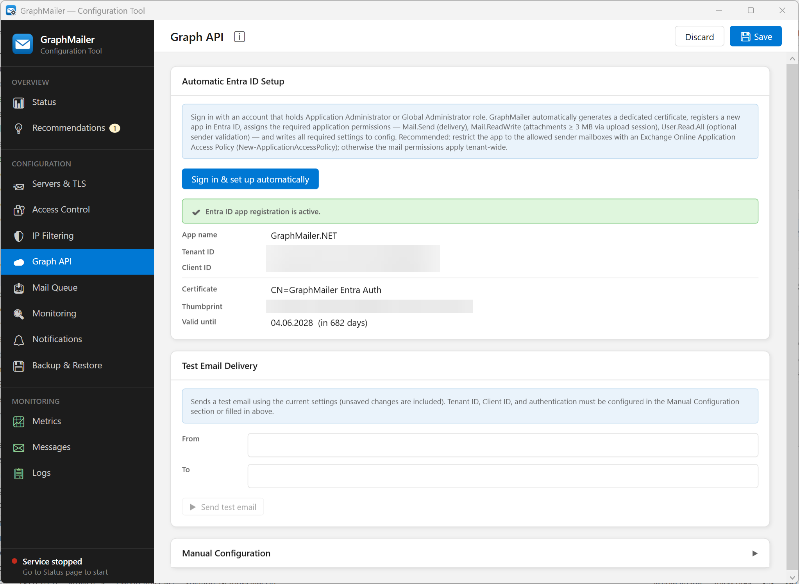

# Graph API

This is the **Graph API** page of the Configuration Tool — where GraphMailer's connection to
Microsoft 365 lives. It has three parts: the **automatic setup wizard**, a **test email** tool, and
**manual configuration**.

If you have not connected your tenant yet, start with the step-by-step
**[Entra / Graph Setup](../getting-started/entra-setup.md)** guide; this page is the field-level
reference.

> [!NOTE]
> Connection changes here apply to the running service **without a restart**.

## Automatic Entra ID Setup

The **“Sign in & set up automatically”** button runs the wizard that registers GraphMailer in your
tenant, generates an authentication certificate, grants the required permissions, and fills in all
the settings below for you. This is the recommended path and is documented in full on the
[Entra / Graph Setup](../getting-started/entra-setup.md) page.

After a successful run, the page shows the result: app name, Tenant ID, Client ID, certificate
subject, thumbprint and expiry date.

### Registration status

Whenever the page opens with a configured registration, GraphMailer asks Entra ID for a token and
reads which application permissions it actually carries. The box above the details reports what came
back:

| Box | Meaning |
|---|---|
| Green — *All Graph permissions this configuration needs are granted* | Nothing to do. |
| Yellow — *Graph permissions are missing* | The named permissions are not granted. Run **Sign in & set up automatically**: it keeps the existing registration and certificate and only adds what is missing. Granting them by hand in the Entra portal works too; either way an administrator has to consent. |
| Grey | The check could not run — no credentials configured, no network, or Entra rejected the sign-in. The reason is shown; this is **not** a statement that permissions are missing. |

This is the same check behind the *"Graph application permissions are missing"*
[notification email](notifications.md) and the **Graph Permissions** row on the
[Status](../monitoring/status.md) page, so all three always agree.

> [!TIP]
> After upgrading GraphMailer, look at this box once. A new version can require a permission your
> app registration was never granted, and mail that needs it fails until the wizard is re-run.

## Test Email Delivery

Sends a test message with the **current** settings (including unsaved changes), so you can confirm
the connection before saving.

- **From** — a sender address; must be a licensed mailbox in your tenant.
- **To** — any recipient address.

The subject is `<subject prefix> Connection test`, using the **Subject prefix** from the
[Notifications](notifications.md) page (`[GraphMailer]` by default) — so an inbox rule built for
the notifications catches the test mail as well.

> [!WARNING]
> The **From** address must be a real Microsoft 365 mailbox (or one of its aliases). A test from an
> address the tenant does not own is rejected.

## Manual Configuration

Expand this section if the app registration is managed for you instead of by the wizard.

| Field | Meaning |
|---|---|
| Tenant ID | Your Entra tenant GUID (Azure Portal → Entra ID → Overview). |
| Client ID (App ID) | The registered application's ID (App registrations → your app → Overview). |
| Authentication | Either a **Client Secret** or a **Certificate** (see below). |

### Authentication: secret or certificate

- **Client Secret** — a secret string created in *Certificates & secrets*. Stored **encrypted**
  (`ENC[…]`) in the config, never in plain text.
- **Certificate** — selected from the Windows store (`LocalMachine\My`, Client Authentication). Its
  **thumbprint** is saved in the config and used to locate it at runtime. The certificate must also
  be uploaded to the Entra app registration.

> [!IMPORTANT]
> When both a secret and a certificate are configured, the **certificate takes precedence**.
> Certificate authentication is preferred: nothing secret is stored that could leak, and Entra
> trusts the exact registered certificate.

> [!NOTE]
> Selecting a certificate by **thumbprint** (what the picker stores) is recommended over selecting
> by subject name. Entra trusts the one specific certificate you registered; a subject-name match
> would auto-pick the newest certificate, which may not yet be registered in Entra. Subject-name
> selection exists mainly for zero-downtime rotation where *both* certificates are pre-registered.

## Required permissions

GraphMailer needs these Microsoft Graph **application** permissions. The wizard grants all five,
whether or not your configuration currently uses them, so switching an option on later needs no
second trip to the Entra portal:

| Permission | Used for | Needed when |
|---|---|---|
| `Mail.Send` | Sending mail (core function). | Always. |
| `Mail.ReadWrite` | Large attachments (≥ 3 MB) uploaded as a draft. | Always. |
| `User.Read.All` | Sender validation against the tenant directory. | Sender validation is on. |
| `Domain.Read.All` | The tenant's verified mail domains, which decide which of a mailbox's addresses may send. | Sender validation is on. |
| `Group.Read.All` | Groups, public folders and mail users as senders. | Sender validation is on **and** mailbox-less senders are accepted. |

Only the permissions your configuration actually needs are checked — an installation without sender
validation is complete with the first two.

> [!CAUTION]
> These permissions apply tenant-wide by default. Restrict GraphMailer to only the mailboxes it
> should use with an Exchange Online **Application Access Policy** — see the
> [Entra / Graph Setup](../getting-started/entra-setup.md) guide.

## Troubleshooting

- **Test mail fails with `MailboxNotEnabledForRESTAPI`** — the sender has no Exchange Online mailbox
  (e.g. an on-premises hybrid user). See [Troubleshooting](../reference/troubleshooting.md).
- **Authentication errors after setup** — confirm an administrator granted admin consent, and that
  the certificate (or secret) in the config matches the one registered in Entra.
- **You received a "Graph application permissions are missing" email** — open this page and read the
  registration status box; it names the missing permissions. Re-running the wizard grants them
  without touching the existing registration or certificate.
- **Certificate expiring** — renew it from this page; see
  [Entra / Graph Setup → Renewing the certificate](../getting-started/entra-setup.md).

## Related

- [Entra / Graph Setup](../getting-started/entra-setup.md) — full setup and renewal walkthrough
- [Access Control](access-control.md) — Microsoft 365 sender validation (`User.Read.All`)
- [Monitoring](monitoring.md) — alerts for permission gaps and certificate expiry
