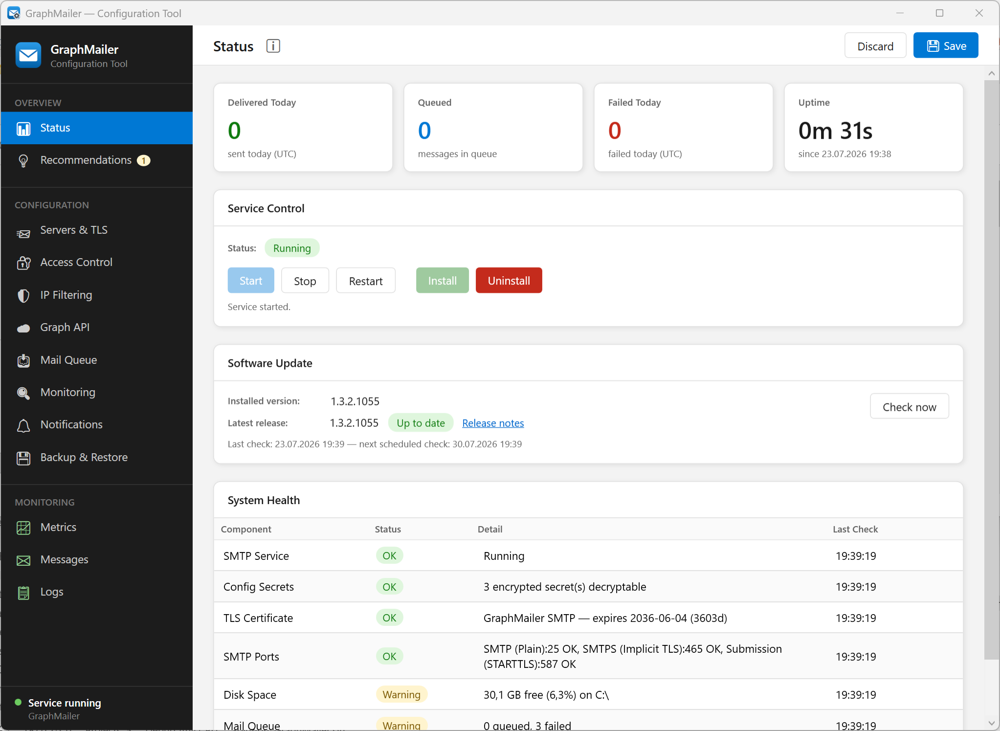

# Status

This is the **Status** page — the dashboard you land on when you open the Configuration Tool. It
gives an at-a-glance view of how GraphMailer is doing right now and lets you start, stop, and manage
the Windows service.

> [!NOTE]
> This page is **read-only monitoring** plus service control — it does not change any configuration.

## At-a-glance KPIs

Four cards across the top summarise current activity:

| Card | Shows |
|---|---|
| Delivered Today | Messages successfully sent to Microsoft 365 today. |
| Queued | Messages currently waiting in the queue to be delivered. |
| Failed Today | Messages that failed delivery today. |
| Uptime | How long the service has been running. |

## Service Control

A status badge shows whether the service is **Running**, **Stopped**, or another state, with buttons
to manage it:

| Button | Action |
|---|---|
| Start / Stop / Restart | Control the running Windows service. |
| Install / Uninstall | Register or remove the GraphMailer Windows service. |

> [!TIP]
> Use **Restart** here after changing any restart-required setting (SMTP listeners, TLS certificate,
> mail directory, polling interval) — the toolbar shows a *“Restart required”* badge to remind you.

> [!IMPORTANT]
> The Configuration Tool runs elevated so it can control the service. Stopping the service stops
> **all** mail relaying — connecting applications will be unable to send until it is running again
> (their mail is typically retried on their side, not queued by GraphMailer while it is down).

## Software Update

Shows the installed GraphMailer version and — when the weekly update check on the
[Monitoring](../configuration/monitoring.md) page is enabled — the latest release published
on GitHub, with a badge (*Up to date* / *Update available*), the time of the last and next check,
and a **Release notes** link.

| Element | Meaning |
|---|---|
| Installed version | The version of this installation. |
| Latest release | The newest release found on GitHub by the last check. |
| Check now | Asks the running service to query GitHub immediately (works even while the weekly check is disabled). |

> [!NOTE]
> Updates are never installed automatically — download the new release from GitHub and install it
> yourself. An optional email alert for new releases can be enabled on the
> [Notifications](../configuration/notifications.md) page.

While an update is available, a small green badge with the new version number also appears next to
the GraphMailer name at the top of the sidebar — visible on every page. Clicking it opens this
Status page.

## System Health

A table of the same self-checks configured on the [Monitoring](../configuration/monitoring.md)
page — each component (certificates, disk space, SMTP ports, Graph API) with its current status
(OK / Warning / Error), a detail message, and when it was last checked. This is the quickest place
to see *why* something is wrong.

> [!IMPORTANT]
> The **Graph Certificate** row matters more than it looks. When Graph API uses certificate
> authentication and that certificate expires, GraphMailer cannot obtain a token — delivery stops
> and no [notification email](../configuration/notifications.md) can be sent about it, because
> sending one would need the very certificate that just lapsed. This row and the log are the only
> places the condition shows up.

## Decryption warning banner

If a stored secret cannot be decrypted (for example after restoring config to a different machine,
where the encryption key differs), a red banner appears at the top. Re-enter the affected secret on
its page — [Graph API](../configuration/graph-api.md) or [Access Control](../configuration/access-control.md) — and save to clear it.

## Related

- [Monitoring](../configuration/monitoring.md) — configure the checks shown here
- [Metrics](metrics.md) — longer-term statistics and trends
- [Logs](logs.md) — the detailed event log behind a problem
